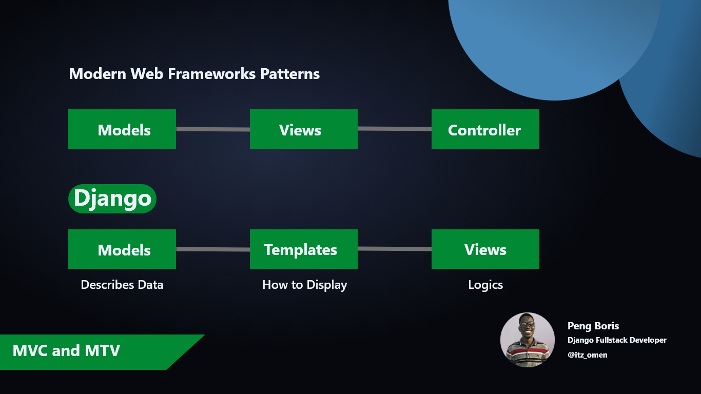

# Build A Portfolio with Django | Learn Django for Beginner

## [Watch the Tutorial Now](https://www.youtube.com/watch?v=djNrEft8d_I&list=PLnH40zIDkjbSvyke2aopMo5EVbtbI73mH)

- [Notes and Useful commands](notes.md)
- [Simple Deployment Notes](Deploy.md)

# Set up
Steps:
-> These steps are explained [here](https://youtu.be/djNrEft8d_I)
1. Clone/pull/download this repository
2. Create a virtualenv with `python -m venv env`
3. Activate virtual environment `source env/bin/activate`
4. Install dependencies with `pip install -r requirements.txt`

### Create superuser
`python manage.py createsuper`

### Finally runserver
`python manage.py runserver`

